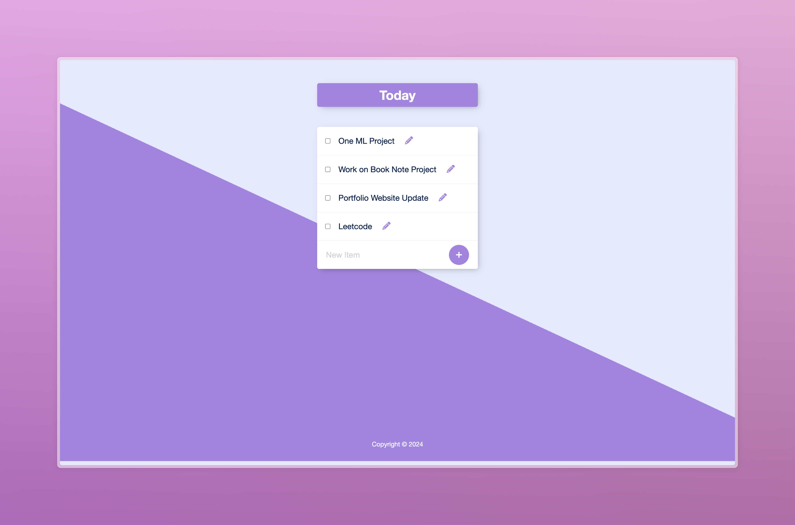

# PermaList

PermaList is a simple to-do list web application built with Node.js, Express.js, and PostgreSQL. It allows users to create, edit, and delete tasks on their to-do list. The application provides a user-friendly interface for managing tasks efficiently.



## Features

- **Create Tasks:** Users can add new tasks to their to-do list.
- **Edit Tasks:** Users can modify the title of existing tasks.
- **Delete Tasks:** Users can remove tasks from their to-do list.
- **Persistent Storage:** Tasks are stored in a PostgreSQL database, ensuring data persistence between server restarts.

## Technologies Used

- **Express.js:** A web application framework for Node.js used to handle routing and server-side logic.
- **Body-Parser:** Middleware for parsing incoming request bodies, essential for handling form data.
- **PostgreSQL:** A powerful, open-source relational database used to store task information.
- **EJS:** Embedded JavaScript templating engine used for rendering dynamic HTML pages with data from the server.

## Prerequisites

Before running the application, make sure you have the following installed:

- [Node.js](https://nodejs.org/)
- [npm](https://www.npmjs.com/) (Node.js package manager)
- PostgreSQL installed and running on your machine

## Installation

1. Clone the repository:

   ```bash
   git clone https://github.com/nanaagyei/permalist.git
   ```

2. Navigate to the project directory:

   ```bash
   cd your_repository
   ```

3. Install dependencies:

   ```bash
   npm install
   ```

4. Set up PostgreSQL database:

   - Create a new database named `permalist`.
   - Run the SQL script `schema.sql` in the repository to create the necessary table.

5. Configure database connection:

   - Open `index.js` and update the database configuration details (`user`, `host`, `password`) to match your PostgreSQL database settings.

## Usage

1. Start the server:

   ```bash
   npm start
   ```

2. Open your web browser and navigate to `http://localhost:3000` to access the application.

3. Use the application to create, edit, and delete tasks on your to-do list.

## Acknowledgments

This project is inspired by the need for a simple and efficient way to manage tasks and is provided for educational purposes.

## License

This project is licensed under the [MIT License](LICENSE).

---

Feel free to contribute to this project by submitting bug reports, feature requests, or pull requests. If you encounter any issues or have suggestions for improvements, please feel free to open an issue. Thank you for using our PermaList application! 📝
